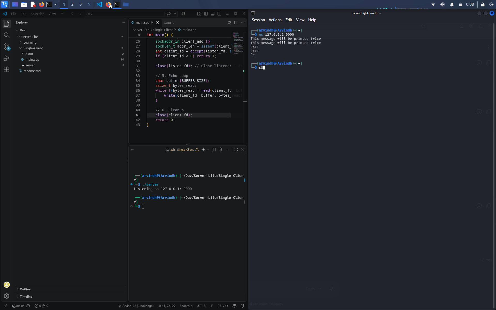
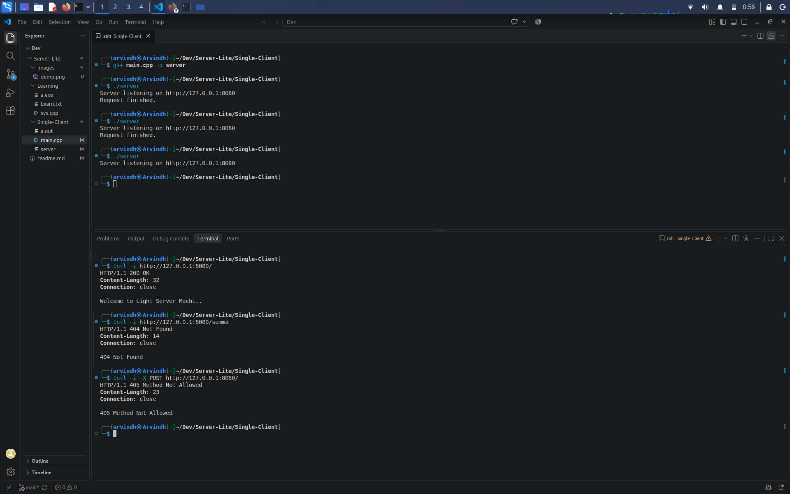
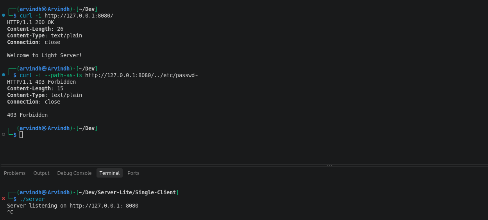
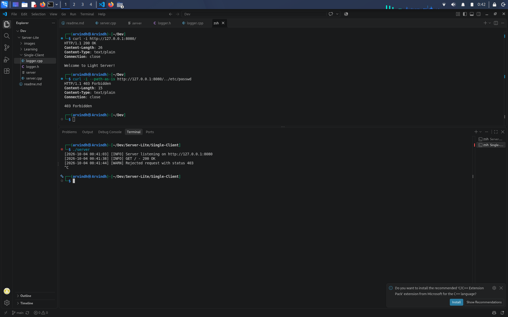
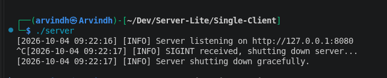
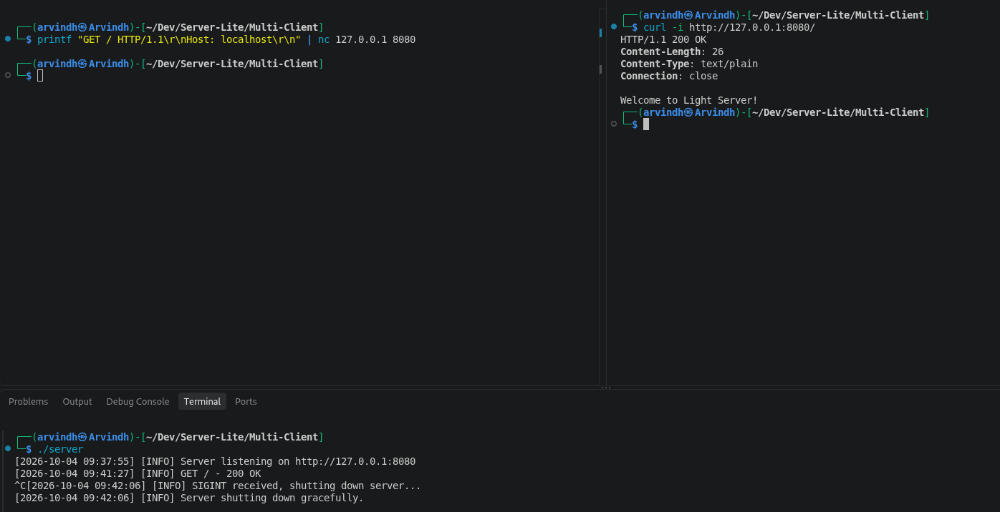

Light Web Server
A small HTTP/1.1 web server written in C++ .

I'm building this mainly as a learning project to understand what actually happens when a browser or curl connects to a server — starting from a TCP connection, reading the request, parsing it, finding a file, and sending back an HTTP response.

To Test :

Clone into Mutli-Client and execute : 
    g++ -pthread server.cpp logger.cpp -o server
    ./server
                        (or)
                        
Clone into Single-Client and execute:
    g++ server.cpp logger.cpp -o server
    ./server

LOGS:
1. Learnt to operate with files only using open,read,close and write.
2. Built a simple TCP echo server that handles one client and succesfully tested it with nc.

3. Now it parses the request line to verify it's a valid `GET` call, replies with plain text (`200 OK` for `/`, `404` for anything else, `405` for other methods, or `400` if the request is not formatted properly), and closes the connection. I also added `SO_REUSEADDR` with the correct byte size so the port frees up immediately on restart.

4. I have replaced naive single-packet read() and write() calls with an accumulated, signal-safe (EINTR) recv() loop that halts on \r\n\r\n, full-buffer sendAll(), case-insensitive header parsing with Host validation, a directory traversal guard (.. check).

5. Added Logging system with Time Stap and Status

6. Handles Ctrl+C signal - (SIGINT) and gracefully shuts down the Server

7. Added MultiClient Support making the Server to handle multiple thread simulatenously

8. Now the Server instead of sending a plain/text reponse it can now send .html responses